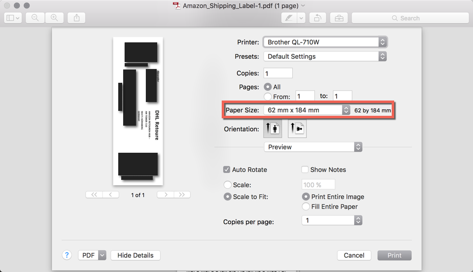

# label-print-plugins

## Introduction
The goal of this project is to provide print plugins for Mac OS X which convert return or shipping labels to be printed on 62mm roll paper. This will work on any consumer or professional grade label printer which is able to print on 62mm self-adhesive thermal paper rolls.

Some companies offer to download a PDF return label in ISO A4 or US Letter Format. No scissors or glue sticks are required if there is already a print plugin available.

These labels can be printed from ~~any~~ most Mac applications using the system print dialog. Some applications like Chrome have a button to switch to the system print dialog. Others like Adobe Reader pretend being not able to save a PDF when a print plugin is executed.

## Demo screenshots
### Before

### After

